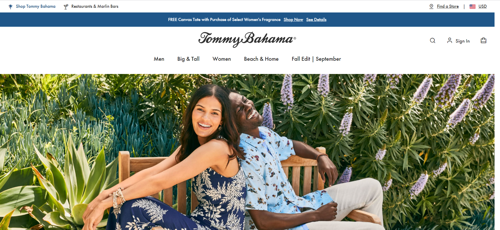
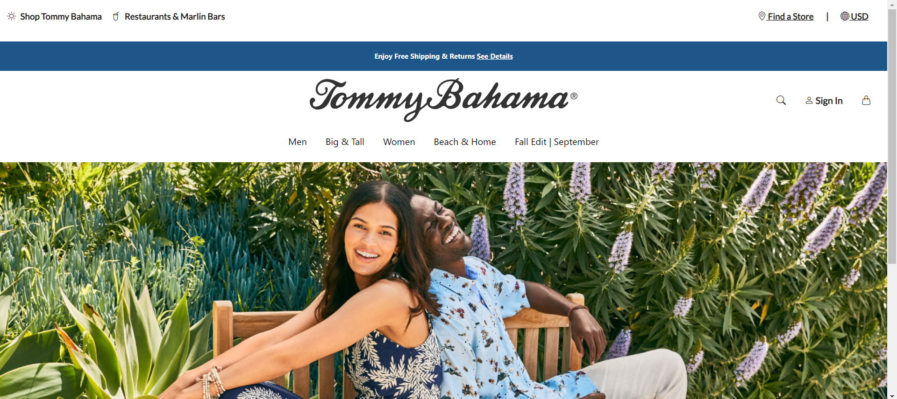

## Funky Fresh

When I first started working with HTML/CSS, I thought to myself, "Is there another coding language that can get harder than this?" Struggling to make the text on my simple website centered on the page, the only way to achieve those results was through brute force and lots of margin and padding tweaks. However, being introduced to UI Frameworks such as Bootstrap 5, making pretty websites does not have to take forever to perfect!

## Bootstrap Saving Lives

With Bootstrap 5, making websites with HTML/CSS became a lot easier and faster for me. Now, I do not have to spend most of my time making little adjusts to my margins and paddings to center my images and text as Bootstrap 5 includes lots of different classes that we can use in our HTML and it will automatically apply styling for us! What I found to be the most useful and used class Bootstrap 5 has to offer is the container/container-fluid class. I also found that Bootstrap 5 inputs and navigation bar classes makes implementing menus and widgets on my website a lot easier and faster too. All I have to do it change the color and text of these inputs/navigations and BOOM! A WEBSITE! Using Bootstrap 5 has saved me from the dark pits of coding in raw HTML/CSS and I will repay my life to the creators of this beautiful framework.

## Personally Speaking...

One of my assignments using Bootstrap 5 included recreating a website of our choice. This was a difficult task for me since we were creating a website from scratch and the website I picked included navigation bars stacked on top of each other and this was the first time I was attempting at something like that. However, this task would have been more difficult had I was asked to do this using raw HTML/CSS, which I am even more grateful that we were allowed to use Bootstrap 5.

The website I decided to recreate was the <a href="https://www.tommybahama.com/">Tommy Bahama</a> website. My recreation of the Tommy Bahama website used Bootstrap 5 and a little bit of CSS for styling. My recreation was also before they updated it to their October Fall Edition and had a video playing at the center of their website. I also did not include a moving menu slide bar, since the real website had the blue top menu portion as slides to switch between different texts and it was out of my scope of knowledge at the current moment.

Below are two images:

- Top - Real Tommy Bahama Website
- Bottom - My Recreation of the Tommy Bahama Website.

    

        
    

    

        
    

While there are some minor differences, such as small differences in spacing and the logos for the top menu, overall my recreation of the website was very similar and it would have taken me twice the time had I only used raw HTML/CSS.

## Will We Meet Again?

Now with UI Frameworks under my tool belt, it is safe to say that I will no longer be looking at website development the same way. Thanks to Bootstrap 5, there is no going back to raw HTML/CSS!