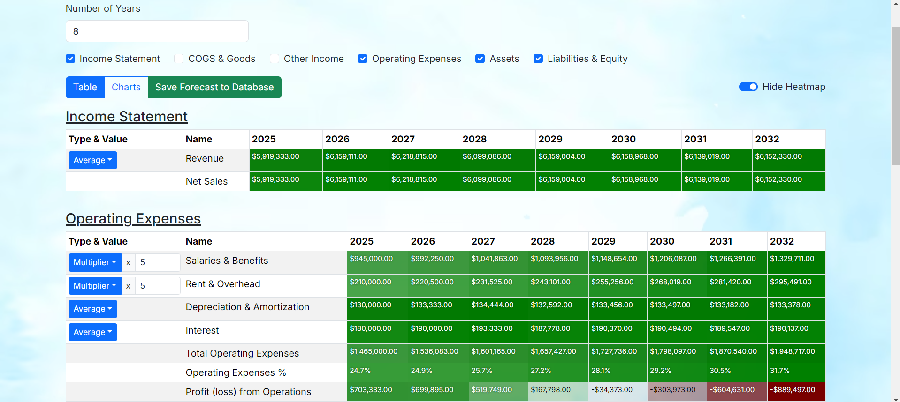
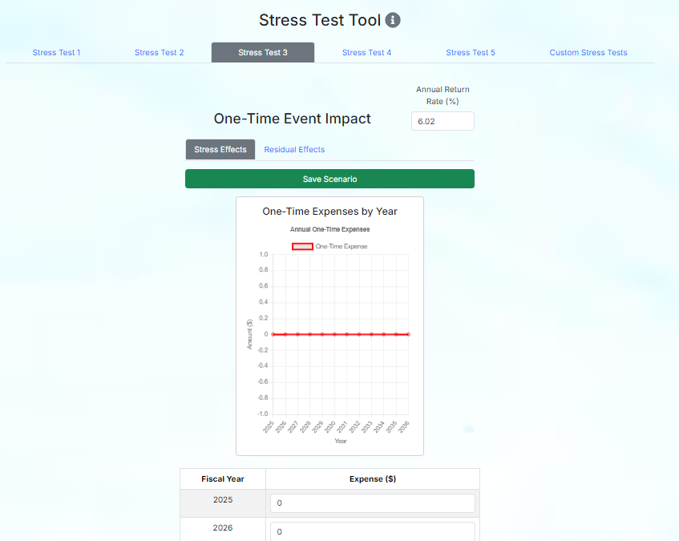

Pineapple Spire is a web application developed for Spire Hawai'i to help turn their Fiscal Sustainability Model (FSM) spreadsheet into a user friendly web application. By centralizing the FSM spreadsheet into a web application, Spire Hawai'i and their clients are able to navigate and work on their financial information in one platform, rather than working across multiple platforms.

Spire Hawai'i Fiscal Sustainability Model has four main components:
- Financial Compilation: Includes clients income statement and balance sheet forecast options, multiplier or average.
- Stress Test Analysis: Give the option to display different components of the stress tests on the Sustainability Model.
- Sustainability Model: Includes information from the Financial Compilation and Stress Test Analysis, showing only output information.
- Workpapers/Stress Tests: Different forecasting scenarios that help clients see what would happen if unexpected events happen to their financial statements.

Our group worked closely with representatives from Spire Hawai'i to help transform these main components into a web application and other quality of life upgrades.

My role in this was creating the foundation for the Financial Compilation page, migrating the sample Financial Compilation given on the spreadsheet. I created the Financial Compilation table onto the web page, adding the ability to show/hide different parts of the income statement and adding the multiplier and average forecasting options.

I also worked on one of the five stress test pages, scenario #3, and adding the feature to change between stress effects and residual effects.

This project was for my software engineering class, utilizing Nextjs as our main framework. To explore the rest of the web application, here is a link to our project homepage: <a href="https://pineapple-spire.github.io/">Pineapple Spire</a>