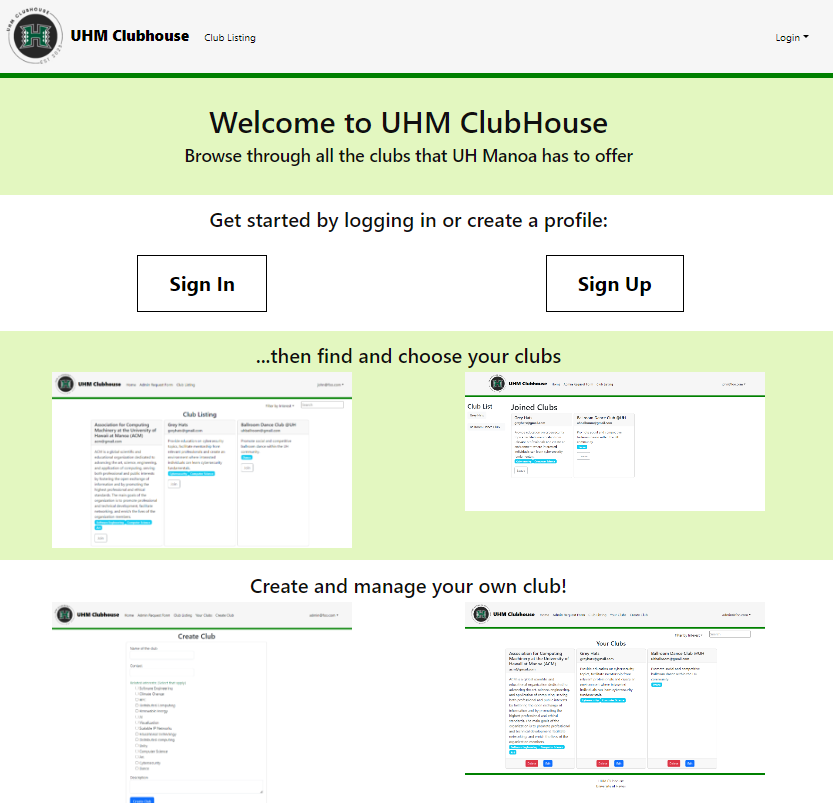

The UHM (University of Hawai'i at Manoa) Clubhouse is a web application that was developed to help centralize all the clubs at the university. By creating a hub for the clubs at Manoa, students and faculty are able to easily browse through the wide range of clubs the university has to offer! From nationally recognized clubs to niche hobby clubs, UHM Clubhouse has it all.

This web application has three main roles- users, club admins, and super admins. Users are able to browse for clubs through a search function or by what their interests are, join and leave clubs, and request to become a club admin in order to start a club or manage an existing club if the user becomes apart of that clubs board member. In addition to the user functionalities, club admins are able to create, edit, and delete their own clubs. Super admins have the same functionalities as club admins but what sets super admins apart from club admins is that they are allowed to grant users club admin functionalities through a form on the website.

There are several different components found within this web application:
- Landing Page: Brief instructions for creating or logging into an existing profile.
- Sign In / Sign Up Pages: Users can either register or log into an existing profile.
- Home Page: Shows users what clubs they are apart of and will display the most recent club information.
- Club Listing Page: Shows all the available clubs at the university. Users can also join and leave clubs through this page. Users can also search for a club or filter clubs by interest areas.
- Club Admin Page: Shows the club admin what clubs they currently manage and they are able to edit the club information or delete the club if it's no longer active.
- Admin Request Form Page: Users can request to become a club admin through submitting their email.
- Current Admin Request Page: Shows super admins which users are requesting to become a club admin and they can hide the request if its no longer applicable.

This was the final group project for my ICS 314 class where we all collaborated to develop this application over the course of a couple of months through GitHub. My main role in development was to create the club admin home page where it shows club admins what clubs they currently manage. I was also in charge of creating the edit club function and the delete club function found on the club admin page. I also helped create the clubs and club interests database through using MongoDB collections. In addition to my role, each team member had to practice agile project management through GitHub where we created milestone project boards to track and organize the teams tasks. 

Here is a link to our project home page which outlines the overview of the application, a development guide, and the continuous integration of the application. Link: https://uhm-clubhouse.github.io/